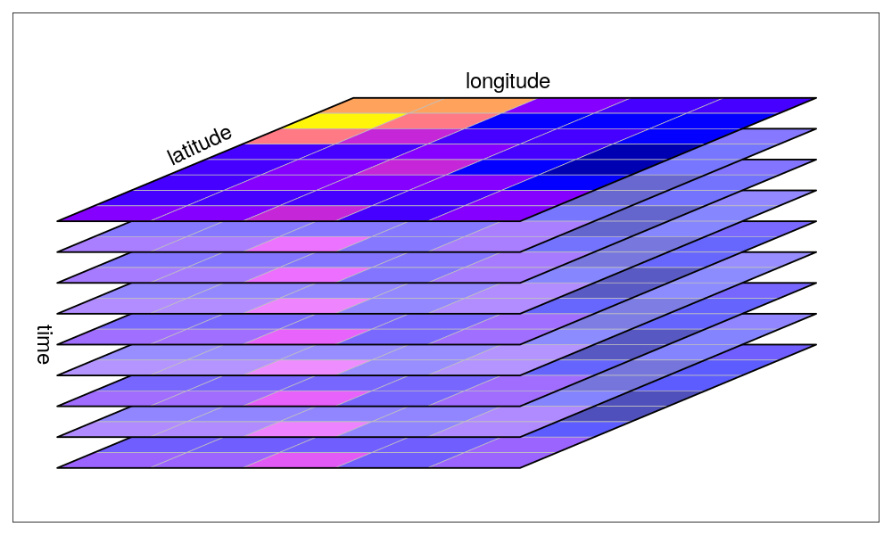
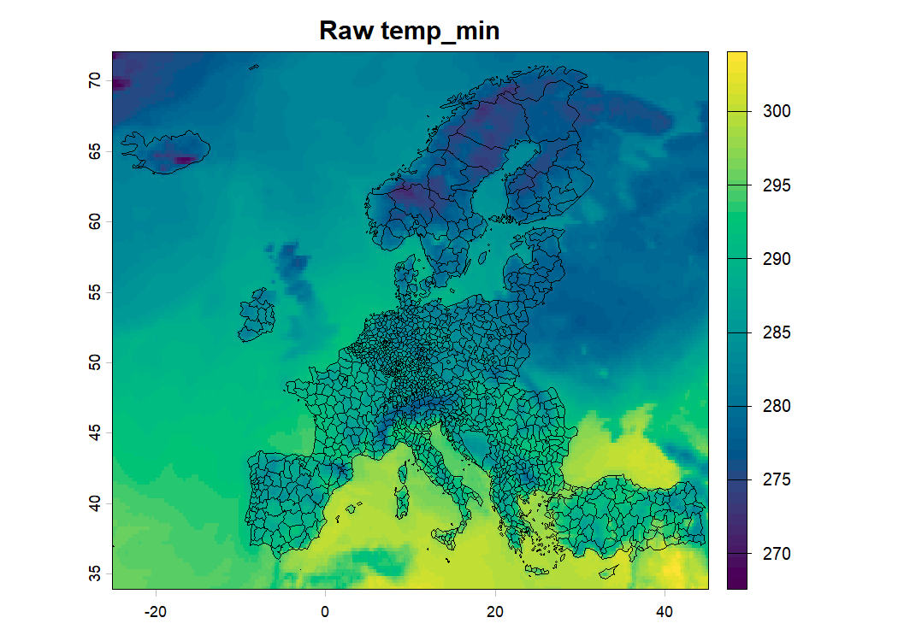
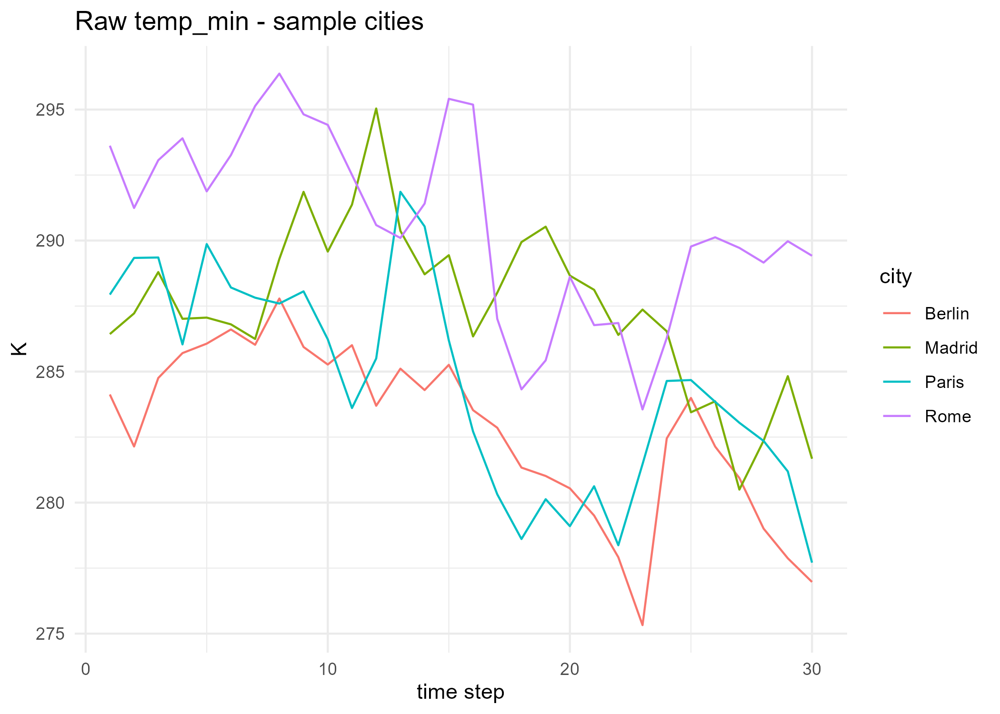
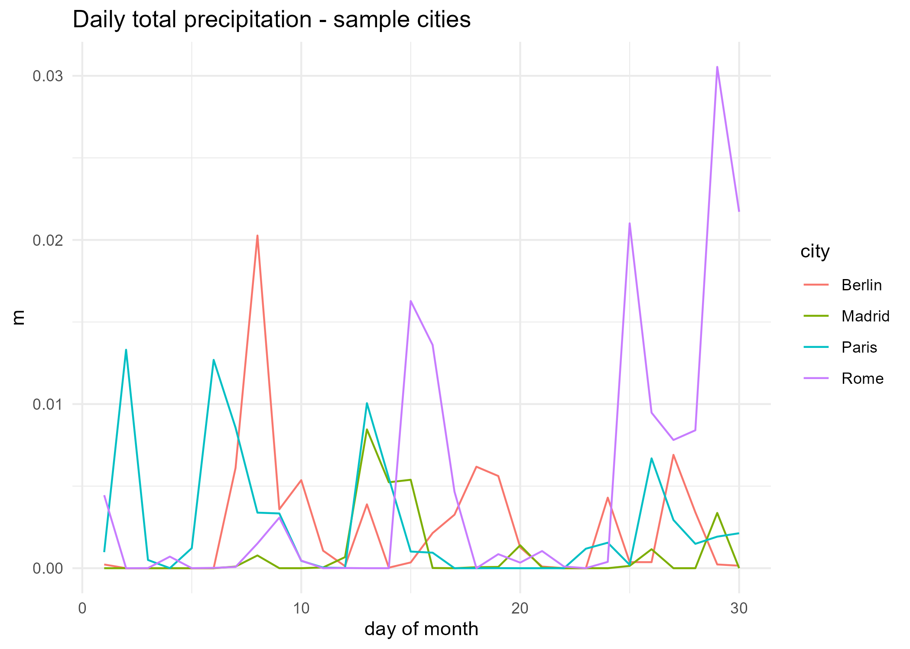
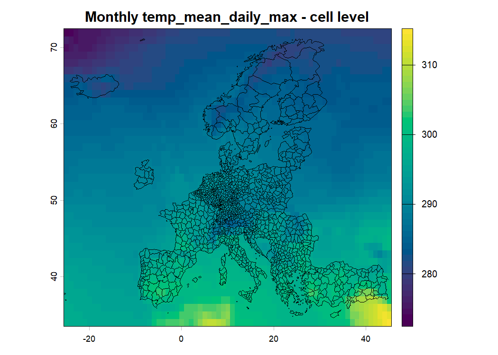
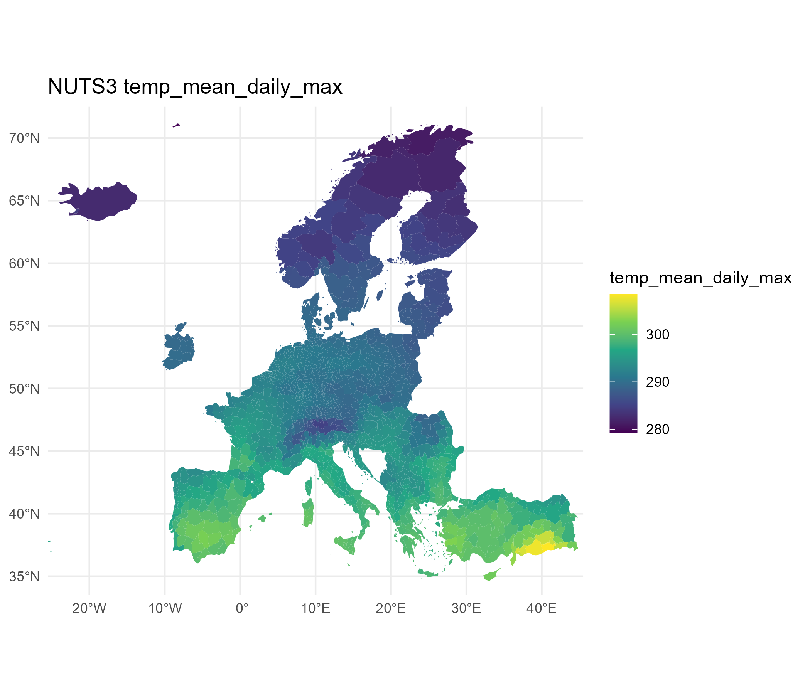

## Objectives

- Where weather data comes from, and what format it comes in
- A short, readable R pipeline: download, check, aggregate in time, aggregate in space, merge with economics data, and regress
- Kept **deliberately simple** for now: one month of data, coarse resolution, one cross-section
- What would need to change to turn this into a real research design

---

## Weather data: two families

::: {.incremental}
- **Station data**: accurate at a point, but stations appear/disappear over time (missing data, needs interpolation)
- **Gridded / reanalysis data**: a uniform record over space and time, built from station data plus a physical model
  - [ERA5](https://cds.climate.copernicus.eu/datasets/reanalysis-era5-single-levels) (global, hourly, ~31km): what we use here (but should use ERA5-Land, ~9km, the standard but makes the pipeline slower)
  - PRISM (US only, ~4km), CRU (global, monthly, ~56km)
:::

---

## What "gridded" actually looks like

{fig-align="center" width="95%"}

---

## From cube to table

R reads a NetCDF file in as a `SpatRaster`: the cube on the previous slide, still a cube (not yet
a table). To plot it, extract a time series, or run a regression, we reshape it into a **long
("panel") table**: one row per (longitude, latitude, day) combination.

| lon | lat | day | temp_mean |
|---|---|---|---|
| 2.5 | 48.5 | 1 | 289.3 |
| 2.5 | 48.5 | 2 | 288.9 |
| 5.0 | 48.5 | 1 | 290.1 |
| 5.0 | 48.5 | 2 | 290.4 |

Each grid cell (lon, lat) is a "unit" and each day is a "time period": exactly the panel
structure used in the regressions later in this course.

`terra::extract()` does this reshape for a handful of points (used in `02` and `03` to build the
sample-city time series); `terra::app()` / `tapp()` do the *reverse*, collapsing rows back down
without ever leaving the cube (used in `03` to go from daily to monthly).

---

## Key formats and packages {.smaller}

| Name | What it is | Why we need it |
|---|---|---|
| **NetCDF** (`.nc`) | The file format ERA5 comes in: a self-describing array format for gridded, multi-dimensional data | What CDS actually sends us |
| **terra** | Reads/writes rasters and does the cube-level operations (`rast()`, `app()`, `tapp()`, `extract()`) | The engine behind every step in `scripts/` |
| **sf** | Reads and handles vector data: points, lines, polygons | Represents the NUTS3 regions as geometry R can join and plot |
| **exactextractr** | Computes exact area overlaps between a raster and a set of polygons | Step 04: cells to regions |
| **ggplot2** | Grammar-of-graphics plotting | Every time series, and the NUTS3 choropleth maps (paired with `sf`'s `geom_sf()`) |
| **ecmwfr** | Talks to the Copernicus Climate Data Store API from R | Step 01: the actual download |

Cell-level raster maps use `terra`'s own base `plot()` directly, not ggplot2: one fewer
package, and `terra` already has everything needed to draw a `SpatRaster`.

---

## Keeping this pipeline simple, on purpose

| Choice made here | What a real analysis would do instead |
|---|---|
| One month of data | Many years, to get panel/longitudinal variations  |
| ~1° grid (regridded) | Native ERA5 resolution (0.25°) or finer (ERA5-Land, 9km) |
| Collapsed to **monthly** cell values | Kept at **daily** resolution |

<div style="height: 1em;"></div>

We use monthly weather data here for convenience. But in a real project, **Consider using daily-data: daily measures matter to capture weather events!!!** See [@ortiz-bobeaa].

::: {.notes}
Why daily matters: economic damage functions are usually **non-linear** in temperature (a day at
35°C is not "half of" two days at 17.5°C), so time-aggregating before computing the non-linear
response biases the estimated effect. , the same Ortiz-Bobea handbook chapter
cited in the main lecture deck, for how to work with daily gridded data and the
interpolation/aggregation choices involved.
:::

---

## Folder organization

Important to keep this folder structure for reproducibility:
* Have separate folders for **raw** data (the one you download and don't touch), and **intermediary/final** data (the one you transform)
* Your scripts must have precised tasks

<div style="height: 1em;"></div>

```
WeatherData_111/
├── scripts/            # this pipeline (running_all.R sources 00 -> 06)
├── presentation/        # this slide deck
├── code/ERA5_APIKey.R   # your CDS personal access token (gitignored)
├── data/
│   ├── source/          # raw downloads (NetCDF)
│   ├── intermediary/    # cell-level and NUTS3-level aggregates
│   └── final/           # the merged panel ready for regression
├── figures/              # every check map / time series
└── tables/               # the regression output
```

---

## `running_all.R`

The one script which runs everything in the pipeline.

<div style="height: 1em;"></div>

Sources every script below, in order. If you want to have everything at once, run it from the project root 

  * open `era5-weather-data-economics.Rproj` first

<div style="height: 1em;"></div>

```r
source("scripts/00_preamble.R")
source("scripts/01_download.R")
source("scripts/02_visualize_raw_data.R")
source("scripts/03_time_aggreg.R")
source("scripts/04_spatial_aggreg.R")
source("scripts/05_prepare_panel.R")
source("scripts/06_main_regression.R")
```

<div style="height: 1em;"></div>

Now, in the rest of the presentation, we check these scripts one by one.

---

## `00_preamble.R`: packages, folders, and `cfg`

- Loads packages, creates `data/`, `figures/`, `tables/` if missing
- One `cfg` list controls the set of data you are downloading:

```r
cfg <- list(
  year  = 2022,
  month = 9,    # <- set this to YOUR birth month
  area  = c(72, -25, 34, 45),   # Europe: North, West, South, East
  grid  = "1.0/1.0"
)
```

- Registers your CDS key (`code/ERA5_APIKey.R`, gitignored, to keep this private)

---

## `01_download.R`: one month of ERA5 for Europe

- **Temperature** (min/max only): CDS's `derived-era5-single-levels-daily-statistics` dataset.
  It computes the daily statistic for us; each request returns one value per day.
- **Precipitation**: the plain **hourly** `reanalysis-era5-single-levels` dataset instead, and we sum hourly observations to have daily totals.

::: {.callout-note}
CDS rate-limits repeated requests from one account (`403 ... check your retry rate`) and gates
some datasets behind a per-account licence click-through. Two temperature requests 
keeps this comfortably inside that budget.

If you want to download more data, consider building a function which takes into account this quota. Alternatively, consider download from the [Analysis-ready cloud data access](https://cds.climate.copernicus.eu/datasets/reanalysis-era5-land?tab=analysis_ready_data) which is currently under development, but will greatly help in the future the downloading of ERA5 weather data.
:::


---

## How `wf_request()` actually talks to the API {.smaller}

```r
request <- list(
  dataset_short_name = "derived-era5-single-levels-daily-statistics",
  product_type    = "reanalysis",
  variable        = "2m_temperature",
  year = "2022", month = "09", day = cfg$days,
  daily_statistic = "daily_minimum",
  time_zone       = "utc+00:00", frequency = "1_hourly",
  area            = cfg$area, data_format = "netcdf",
  target          = "era5_temp_minimum.nc"
)
wf_request(request, path = dir$source)
```

`wf_request()` (from the `ecmwfr` package):

1. Sends `request` as a query to the CDS API; your key from `wf_set_key()` authenticates it.
2. CDS **stages** the request and returns a job id. It does not compute on demand: your request
   joins a queue. In the console you'll see something like:
   `staging data transfer at url endpoint or request id: <id>`
3. R **polls** the server every few seconds until the job is ready (the `polling server ...`
   spinner). For the derived daily-statistics dataset this can take several minutes.
4. Once ready, the file is downloaded to `path` and named `target`.

---

## `02_visualize_raw_data.R`: does the download look sane?

For each of the 3 raw files: a map of one time step, and a time series at four
sample cities (Paris, Berlin, Madrid, Rome) across every time step in the file.

{width="45%"} {width="45%"}

---

## `03_time_aggreg.R`: daily precipitation {.smaller}

The raw precipitation file is hourly. Sum every 24 hourly layers into one daily total:

```r
n_days <- nlyr(temp_min_daily)
precip_daily <- tapp(precip_hourly, index = rep(seq_len(n_days), each = 24), fun = "sum")
```

`index` assigns hourly layers 1-24 to day 1, layers 25-48 to day 2, and so on; `tapp()`
("apply by group of layers") sums the 24 layers within each group.

{width="55%"}

---

## `03_time_aggreg.R`: collapsing the month to one value per cell {.smaller}

6 monthly temperature summaries get computed, from those two series of daily data:

```r
temp_native <- c(app(temp_min_daily, fun = "mean"), app(temp_min_daily, fun = "min"),
                  app(temp_min_daily, fun = "max"), app(temp_max_daily, fun = "mean"),
                  app(temp_max_daily, fun = "min"), app(temp_max_daily, fun = "max"))
names(temp_native) <- c("temp_mean_daily_min", ..., "temp_max_daily_max")
precip_total <- app(precip_daily, fun = "sum")
```

For each daily data we compute: the mean, the max and the min of the month, using ``terra::app()`` function.

::: {.callout-warning}
`c()` **must be called without names**: `c(name = app(...), ...)` silently returns a plain R
list instead of a `SpatRaster` (no error - only `class()` catches it). Combine first, `names()<-`
after.
:::

Temperature stays at ERA5's native 0.25°, but precipitation was regridded to `cfg$grid` (1°) -
two different grids, so `resample(temp_native, precip_total)` aligns them before the final `c()`.

{width="45%"}

---

## `04_spatial_aggreg.R`: the region-by-cell weight matrix {.smaller}

Going from a grid of cells to a table of NUTS3 regions means answering, for every region: *which
cells overlap me, and by how much?* That mapping is a weight matrix $W$ (regions x cells):

$$
W_{r,c} = \frac{\text{area of cell } c \text{ inside region } r}{\text{area of region } r}
$$

The region-level average is then a matrix-vector product: $\bar{x}_r = \sum_c W_{r,c}\, x_c$.

A tiny worked example (2 regions, 4 cells):

| | cell 1 | cell 2 | cell 3 | cell 4 |
|---|---|---|---|---|
| Region A | 0.6 | 0.4 | 0 | 0 |
| Region B | 0 | 0.1 | 0.5 | 0.4 |

Region A's average = 0.6 x (cell 1's value) + 0.4 x (cell 2's value); a cell with no overlap
(weight 0) simply drops out.

---

## `04_spatial_aggreg.R`: building it in practice {.smaller}

`exactextractr::exact_extract()` builds exactly this matrix internally (using each polygon's
exact geometry, not just "is the cell's centroid inside the region?"), then applies it for us:

```r
weather_nuts3 <- lapply(names(monthly), function(v) {
  exact_extract(monthly[[v]], nuts3, fun = "mean", progress = FALSE)
})
```

Note that if you want to build your own weight matrix (for instance including agricultural land weights, or population weights), better use the approach presented by A. Ortiz-Bobea, which build by hand this matrix. Then, instead of using ``exact_extract()``, it computes the weighted mean directly from the matrix product.


{width="50%"}

---

## `05_prepare_panel.R`: merging in Eurostat GDP

- `eurostat::get_eurostat("nama_10r_3gdp")`: NUTS3 GDP per capita, filtered to `cfg$year`
- Joined to the NUTS3 weather table on the NUTS3 code

::: {.callout-note}
This is a **toy, one-period cross-section**. To build a real panel: loop
`01_download.R` / `03_time_aggreg.R` / `04_spatial_aggreg.R` over several years,
stack the results (adding a `year` column), then join against every matching year.
:::

---

## `06_main_regression.R`: income and temperature

Just for the example, we run a simple regression of 2022 NUTS-3 GDP as a function of the weather observed on the month of ``cfg$month`` - ``cfg$year``.

```r
lm(log(gdp_pc) ~ temp_mean_daily_max + temp_mean_daily_max_sq + precip_total + precip_total_sq,
          data = panel_nuts3)
```

This regression does not make any economic sense. Your task would be to adjust this pipeline, to get the ERA5 data and economic data to suit your own research question.

---

## Roadmap: from this toy run to a real design

1. Loop the download/aggregation steps over several years to get a genuine panel
2. Add location fixed effects once there's within-region variation to use
3. Move from monthly back to **daily** cell-level data before aggregating
   non-linear transformations (see [@ortiz-bobeaa])
4. Swap the area-weighted spatial aggregation for the population-weighted one
   already implemented in `script_to_include/04_Spat_Aggreg.R`
   
---

## Bibliography
